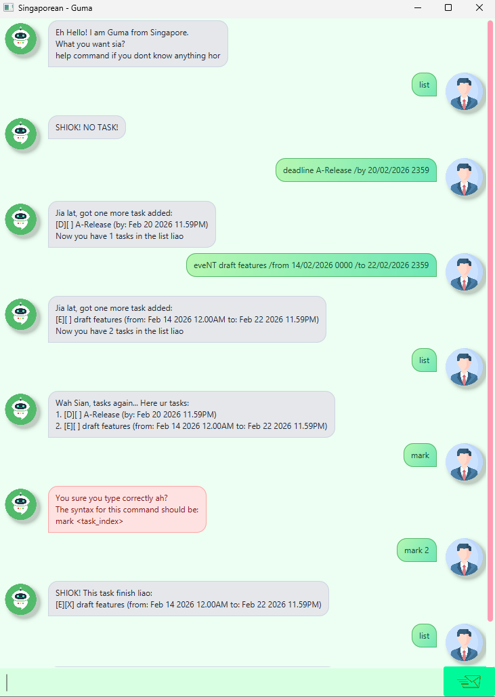

# User Guide

## Description
Guma is a **task management chatbot** that speaks Singlish, 
built to help you capture, organize, and track tasks quickly in a _friendly, local tone_. 

It aims to keep your daily to-dos, deadlines and events tidy, with simple commands 
so you can stay on top of what matters.

- [Description](#description)
- [Quick Start](#quick-start)
- [Features](#features)
  - [Viewing help: `help`](#viewing-help-help)
  - [Listing all tasks: `list`](#listing-all-tasks-list)
  - [Add a todo task : `todo`](#add-a-todo-task--todo)
  - [Add a deadline task : `deadline`](#add-a-deadline-task--deadline)
  - [Add an event task : `event`](#add-an-event-task--event)
  - [Mark a task as done : `mark`](#mark-a-task-as-done--mark)
  - [Mark a task as not done : `unmark`](#mark-a-task-as-not-done--unmark)
  - [Delete a task : `delete`](#delete-a-task--delete)
  - [Find tasks by keyword : `find`](#find-tasks-by-keyword--find)
  - [List tasks on a date : `schedule`](#list-tasks-on-a-date--schedule)
  - [Exiting the Program : `bye`](#exiting-the-program--bye)
- [Saving the data](#saving-the-data)
- [FAQ](#faq)
- [Command Summary](#command-summary)
- [Acknowledgements](#acknowledgements)

## Quick Start

1. Ensure you have Java `17` installed on your computer.
 **For Mac users**: Ensure you have the precise JDK version 
prescribed [here](https://se-education.org/guides/tutorials/javaInstallationMac.html)

2. Download the latest `guma.jar` from [here](https://github.com/guma/ip/releases).

3. Copy the file to the folder you want to use as the _home folder_ for Guma.

4. Open a command terminal, `cd` into the folder you put the jar file in, and use the `java -jar guma.jar` 
command to run the application. 
 A GUI similar to the below should appear in a few seconds. Note how the app contains some sample data.

5. Type the command in the command box and press Enter to execute it. 
e.g. typing `help` and pressing Enter will execute help command.
 Some example commands you can try:
- `list` : List all tasks with indexes
- `event CS2103 Exam /from 04/05/2026 0900 /to 04/05/2026 1030` : Add an event named `CS2103 Exam`
- `delete 2` : Delete the 2nd index shown in the task current list
- `bye` : Exits the application

## Features

> [!NOTE] 
> All commands are **_case-insensitive_**.   Do take note of the formats
> **_\<DateTime\> formats accepted:_**
> - `dd/MM/yyyy HHmm` (e.g., `28/02/2026 1830`)
> - `yyyy-MM-dd HHmm` (e.g., `2026-02-28 1830`)
> 
> **\<Date\> format accepted:_** 
> - `dd/MM/yyyy` (e.g., `28/02/2026`)

### Viewing help: `help`
Lists all supported commands and their syntax.

Format: `help`

### Listing all tasks: `list`
Shows a list of all tasks

Format: `list`

### Add a todo task : `todo`
Adds a task without date/time.

Format: `todo <description>`

### Add a deadline task : `deadline`
Adds a task with a single date-time.

Format: `deadline <description> /by <DateTime>`
- \<DateTime\> format must follow either `dd/MM/yyyy HHmm` or `yyyy-MM-dd HHmm`

Example:
- `deadline submit report /by 28/02/2026 2359` Create an event with a dateline for submit report by 
28th Feb 2026, 11:59 PM.

### Add an event task : `event`
Adds a task with start and end date-time.

Format: `event <description> /from <DateTime> /to <DateTime>`
- <DateTime> format must follow either `dd/MM/yyyy HHmm` or `yyyy-MM-dd HHmm`

Example:
- `event cs2103 lab /from 2026-02-28 1400 /to 2026-02-28 1600` Add an event named 
`cs2103 lab` from 2:00 PM to 4:00 PM on 28 Feb 2026.

### Mark a task as done : `mark`
Marks a task (by index) as completed.

Format: `mark <index>`

Example:
- `mark 2` Marks the 2nd task as done in the list.

### Mark a task as not done : `unmark`
Marks a task (by index) as not completed.

Format: `unmark <index>`

Example:
- `unmark 2` Marks the 2nd task as not done in the list.

### Delete a task : `delete`
Removes a task (by index) from the list.

Format: `delete <index>`

Example:
- `delete 3` Deletes the 3rd task in the list.

### Find tasks by keyword : `find`
Lists tasks that contain the keyword in their description.

Format: `find <keyword>`

Example:
- `find report` Lists tasks with `report` in their description.

### List tasks on a date : `schedule`
Lists tasks that are on or within the specified date.

Format: `schedule /on dd/MM/yyyy`

Example:
- `schedule /on 28/02/2026` Lists tasks on 28 Feb 2026.

### Exiting the Program : `bye`
Saves tasks and exits Guma.

Format: `bye`

Example:
- `bye` Exits the application.

### Saving the data
Tasks data are saved when you exit the application as a text file 
`[JAR file location]/data/gumaStorage.txt`. 
Advanced user are welcome to update data directly by editing that data file.

> [!WARNING]
> Changing your data file could make the format invalid.

### FAQ
Q: How do I transfer my data to another Computer?
A: Install the app in the other computer and overwrite the empty data file it
creates with the file that contains the data of your previous Guma home folder.

### Command Summary
| Action | Format, Example                                                |
|--------|----------------------------------------------------------------|
| help   | `help`                                                         |
| list   | `list`                                                         |
| todo   | `todo <description>` e.g., `todo change mouse pad`          |
| deadline | `deadline <description> /by <DateTime>` e.g., `deadline submit report /by 28/02/2026 2359` |
| event  | `event <description> /from <DateTime> /to <DateTime>` e.g., `event cs2103 lab /from 2026-02-28 1400 /to 2026-02-28 1600` |
| mark   | `mark <index>` e.g., `mark 2`                               |
| unmark | `unmark <index>` e.g., `unmark 2`                           |
| delete | `delete <index>` e.g., `delete 3`                           |
| find   | `find <keyword>` e.g., `find report`                        |
| schedule | `schedule /on dd/MM/yyyy` e.g., `schedule /on 28/02/2026` |
| bye    | `bye`                                                          |

## Acknowledgements
1. Documentation is inspired by [AddressBook Level-3](https://se-education.org/addressbook-level3/UserGuide.html)
2. **Guma profile image** (`resources/images/guma.png`): Chatgpt image generation
3. **User profile image** (`resources/images/user.png`): Chatgpt image generation
3. **Message button**  (`resources/images/send.png`): Chatgpt image generation
